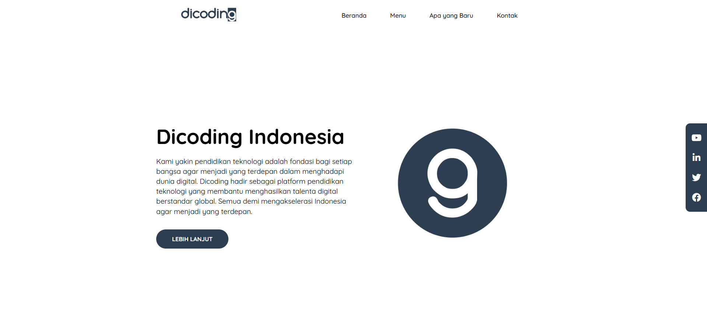

# 🌐 Dicoding Landing Page
This is a **Dicoding Landing Page** project built using **HTML and CSS** as part of a learning exercise or submission project.

---

## 📸 Preview


> The image above shows the appearance of the Dicoding landing page.

---

## 🛠️ Built With
- HTML5
- CSS3

---

## 📁 Project Structure
    dicoding-landing-page/
    ├── index.html # Main landing page
    ├── style.css # Custom CSS styling
    └── img/
    └── preview.png # Preview image

---

## 📌 Notes
> ⚠️ This project only includes the landing page.  
> It is purely created with **HTML and CSS** for practice or submission purposes.  
> No frameworks or JavaScript used.

---

## 🚀 How to View

1. Clone or download this repository:
```bash
    git clone https://github.com/SltnBM/landing-page-dicoding.git
```
2. Navigate to the project directory:
```bash
    cd landing-page-dicoding
```
3. Open index.html directly in your web browser.

